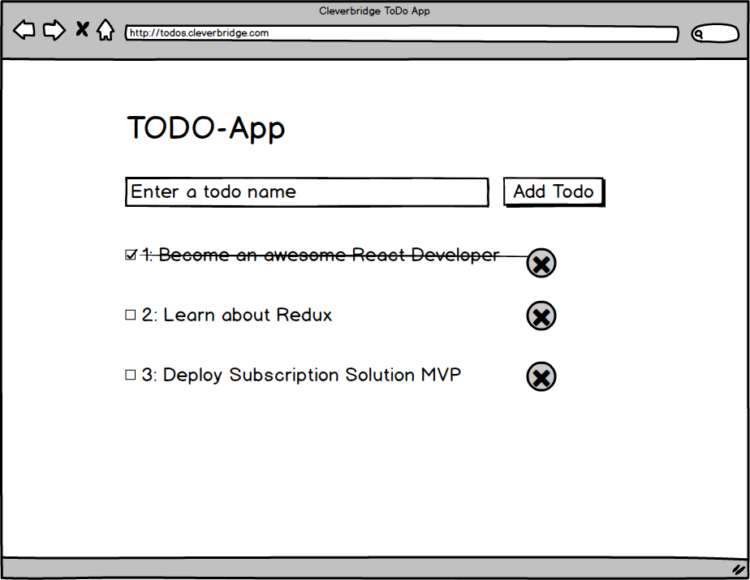
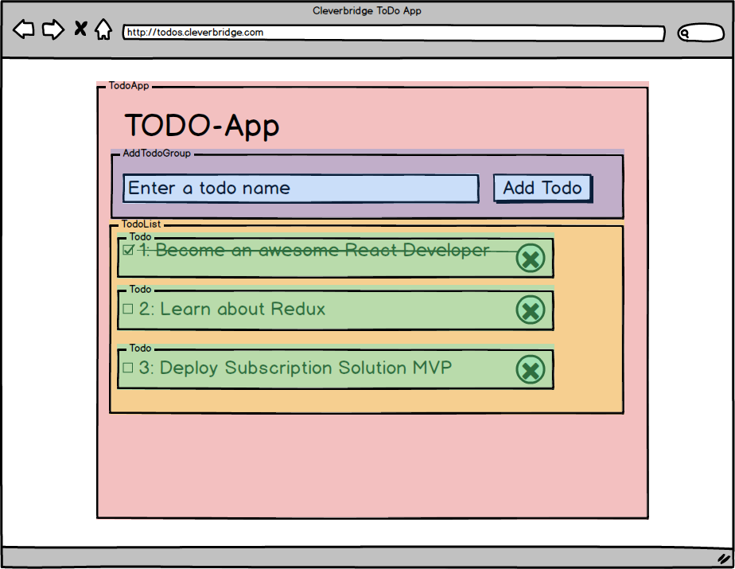

# Lessons

## Lesson 1

- Implement a *Likes* component
  - with a likes prop
  - shows a *BlueLike* component when likes > 0
  - shows a *GreyLike* component when likes <= 0
- For *BlueLike* / *GreyLike*:
  - renders a button with a specific background-color
- Add the Likes component to the *FirstComponent* twice
  - once with likes > 0
  - once without likes

## Lesson 2

- Remove the 'likes' prop from *Likes* component
- Add a likes state which is initially 0 (Hint: You need a stateful component now)
- Add a click-handler which increases the state
- Refactor *BlueLike* and *GreyLike* into a single component called '*LikeButton*'
- Pass the click-handler to *LikeButton*
- Make sure the *Button* components pass the click handler to the html element
- Display the amount of likes inside the Button text

## Lesson 3

- Add propType validation for like button
  - Modify one of the props and see the error in the browser
- Add a default clickHandler to the *LikeButton*
  - e.g. use a console.log or alert in the new default
  - Temporarily remove the clickHandler passed from Likes and see the result

## Lesson 4

- Add Unit tests for the *LikeButton* component
- Make sure the file is covered 100% (branch, statemens, lines)
- Use these test suggestions:
  - **it** displays the number of likes in the text output
  - **it** passes a click Handler to the component
  - **it** has a grey background color when likes prop === 0
  - **it** has a blue background color when likes > 0

## Lesson 5

To get started please checkout `origin/before-lesson-05`.

 

- Start building the TODO app according to the mockup.
- It should have the following features:
  - Subtask 1: There is a list of all todos (completed and open)
  - Subtask 2: Clicking on a todo will mark it as clicked (both in the state and visually)
    - Clicking it again, will mark it as open again.
  - Subtask 3: You can add a name for a new todo and add it to the list
    - After clicking the add button, the input field should be empty again
  - Subtask 4: Clicking the delete button will delete the todo
- Make sure all components which accept props, have their props validated.
- Try adding some basic styling to make it look less 1995-like.
- Tip: Centralize the state in the main component and keep all other components stateless.
  *Note: We'll learn about better state management later. For it's only important to respect the one-way data-flow.*
- Tip: Don't worry about assigning ids right now. Since we don't support sorting or filtering yet, you can simple use the array index to modify/delete a todo.
- **Remeber**: State is immutable. Don't accidentaly mutate the state. this.state.todos.push() is an anti-pattern! Props.todos.push is even worse! Think about data-flow in react apps.
